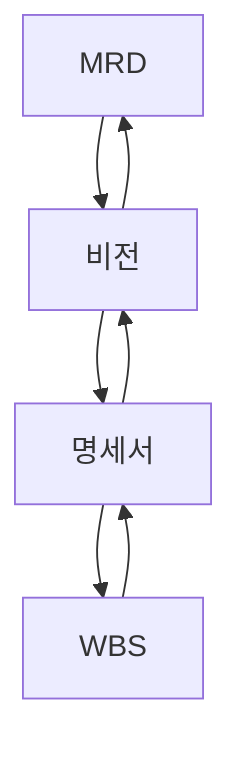

## The Art of Project Management (마음을 움직이는 프로젝트 관리)

### 들어가기
무려 17년인 2006년에 발매되어 Jolt Award 수상한 책
회사 다니면서 밥 벌어 먹는 모든 사람이라면 한 번쯤 읽어야 하는 책

갑작스러운 회사의 조직 개편으로 "팀장"이 되었다. 처음하는 팀장은 아니지만, 팀장이라는 자리는 부담스럽다. 
회사에서 팀장은 "마름"이다. 그러나 팀원에게는 "마름"으로 비춰지면 안되지만, 임원들에게는 "마름"으로 비춰져야 한다. 
그래야 팀원도 편하고 프로젝트도 원할이 진행된다.

그래서 "컴파일러랑만 대화하는 개발자"가 아니라 한팀을 이끌어야 하는 회사원으로써 팀장의 역할과 방법에 대해 다시 한번 상기하기 위해 이 책을 읽는다.

이 책은 프로젝트 성공을 위한 관리위한 프로젝트메니저를 위한 책이자, 프로젝트 구성원이 알고 있어야 할 지식에 대한 책이자.
 
### Chapter 1. 프로젝트 관리의 간추린 역사
```
프로젝트 관리의 목표는 역할을 잘 정의하여 사람들이 업무를 체계적으로 수행하도록 하는 것입니다.
하지만 역할 정의가 목표가 되어서는 안됩니다.
```

   - 프로젝트 관리와 소프트웨어 개발은 예술이 아니다.
   - 시각을 단순화할수록 집중력과 성취도가 높아진다.
   - 단순함이 쉬움을 뜻하지는 않는다.
   - 이론에는 단지 잘못된 이론과 불완전한 이론이라는 두 종류가 있을 뿐입니다.
   - 자아는 커다란 원동력이 될 수도 있지만, 방해물이 되는 순간을 인식할 수 있어야 합니다.
   - 용감한 자는 두려움에 떨지만 그래도 행동하는 사람입니다.
   - 지도자 책임을 맡은 사람이 전투에서 물러나 암박감에 굴한다면 지도자가 아니라 겁쟁이일 뿐입니다.


### Chapter 2. 일정에 관한 진실
```
일정을 산출하는 것은 거의 불가능한 일입니다.
일정 산출을 위해 노력하기 보다는 설계에 승부를 거십시오.
그러면 추가되는 일정을 어느정도 막을 수 있습니다.
```

 - 일정은 미래에서 온 선물이 아닙니다.
 - 일정은 완벽할 필요가 없습니다.
 - 자신에게 돌아올 일정 예측에 대한 책임을 좋아하는 사람은 없습니다.
 - 중간목표 기간은 프로젝트 변동성과 조화를 이뤄야 합니다.
 - 비전은 낙관적으로, 일정은 회의적으로 바라 봅니다.
 - **설계에서 승부를 거십시오**

좋은 설계를 망치는 회의에서 나오는 주요 멘트
- 오버 스팩인것 같아요.
- 그때까지 이 회사에 있을지도 모르는데요.
- 여태까지 그래본적 없어요
- 제가 책임 질께요.

### Chapter 3. 할 일을 파악하는 법
```
비즈니스, 기술, 고객 관점에서 프로젝트를 바라 봐야 합니다.
세개의 관점이 잘 균형을 이루어야 프로젝트를 성공 할 수 있습니다.
이 때는 개발자도 최대한 고객 입장에서 생각해야 합니다.
```


